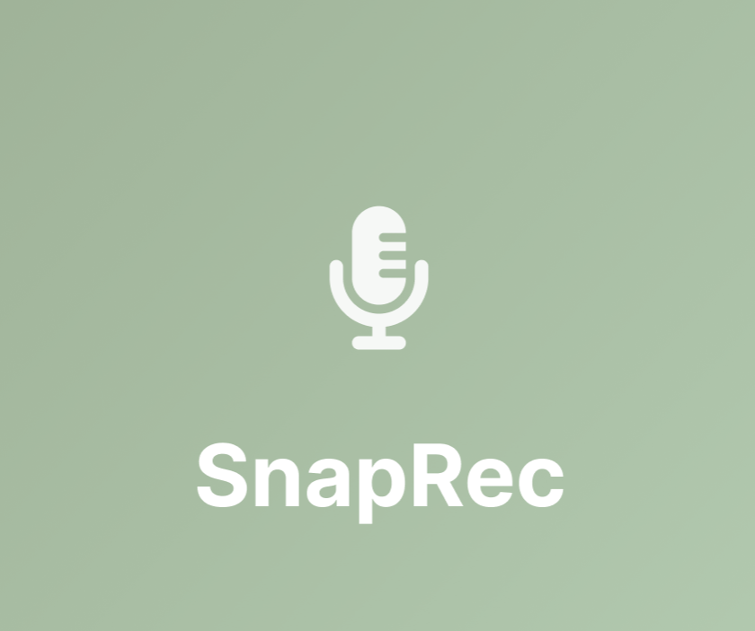

# 📱 IntegradoraAplicacionesMoviles

# SnapRec: Gestión Inteligente de Audios

## ✨ Descripción del Proyecto:
SnapRec es una herramienta de productividad diseñada para capturar ideas al instante. Funciona como una grabadora de voz avanzada que no solo almacena el audio, sino que **transforma automáticamente la voz en texto**, permitiendo a los usuarios crear notas rápidas y precisas sin necesidad de escribir.

> Muchas veces necesitamos tomar notas en situaciones donde escribir es lento, incómodo o imposible (como al caminar, conducir o durante una conferencia rápida). Además, las notas de voz tradicionales tienen la desventaja de que no se pueden "leer" ni buscar contenido específico fácilmente.

**SnapRec** soluciona esto eliminando la barrera de la escritura manual, permitiendo gestionar la información de manera más eficiente mediante la transcripción inmediata. Para capturar el audio y procesarlo, la aplicación hace uso del **micrófono** del dispositivo móvil e integra servicios de reconocimiento de voz.

---

## 👥 Equipo de Desarrollo:

Este proyecto fue desarrollado colaborativamente por:

* **Ricardo Haziel Loza Chavez**
* **Rigoberto Sanchez Jimenez**
* **Luis Angel Pedraza Miranda**

---

## 📸 Capturas de Pantalla:

Para una visión completa de la aplicación, aquí están las pantallas clave:

<table>
  <tr>
    <th>Pantalla de Inicio</th>
    <th>Grabación en Curso</th>
    <th>Detalle de Grabación</th>
  </tr>
  <tr>
    <td style="text-align:center;">
      
      
Pantalla de Inicio

    </td>
    <td style="text-align:center;">
      
      
Grabación de Audio

    </td>
    <td style="text-align:center;">
      
      
Detalle de Grabación

    </td>
  </tr>
  <tr>
    <td colspan="3" style="height:20px;"></td>
  </tr>
  <tr>
    <th colspan="3">Operación CRUD</th>
  </tr>
  <tr>
    <td colspan="3" style="text-align:center;">
      
      
Operación CRUD sobre las grabaciones

    </td>
  </tr>
</table>

---

## ⚙️ Funcionalidades Clave:

* **Grabación Rápida:** Captura de audio con un solo toque.
* **Transcripción Automática:** Convierte la voz en texto editable al finalizar la grabación.
* **Gestión Inteligente:** Categorización de notas (Trabajo, Escuela, etc.).
* **Favoritos:** Marca notas importantes para acceso rápido.
* **Sincronización:** Opción de login para sincronizar notas entre dispositivos.

---

## 📥 Descarga (Releases):

Puedes descargar la última versión del ejecutable firmado (.apk) para instalarlo en tu dispositivo Android desde la sección de 
**<a href="../../releases">Releases de este repositorio</a>**.
